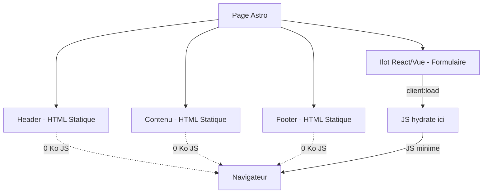

## Le constat de départ

Je ne compte plus le nombre de side projects abandonnés avant même d'avoir écrit la moindre ligne de code utile. Le scénario classique : on lance un `create-next-app`, on configure Tailwind, on ajoute un routeur, un state manager... et passé deux heures de config, la motivation a déjà fondu. 

Le problème, ce n'est pas React. C'est le poids de l'écosystème qu'on se traîne par défaut. Envoyer des centaines de kilo-octets de JS pour hydrater des pages qui n'en ont strictement pas besoin, et devoir maintenir des tonnes d'abstractions pour un simple blog ou une landing page, ça a fini par me pomper toute mon énergie.

## L'architecture en îlots d'Astro

Astro part d'un postulat énorme : par défaut, **zéro** JavaScript au navigateur. Tout est rendu en HTML statique au build. Vous voulez de l'interactivité ? Vous l'hydratez explicitement. Ce sont les fameux *îlots* (ou *islands*).

Le concept n'est pas d'eux : il vient de Katie Sylor-Miller en 2019, popularisé par Jason Miller en 2020. Mais Astro a bâti tout son framework là-dessus.

En clair, le navigateur reçoit directement du HTML pur, sans avoir à télécharger un lourd runtime JS ni à reconstruire un DOM virtuel côté client. Mieux : avec Astro 5 et l'arrivée des Server Islands, on peut même mixer un squelette HTML statique avec des composants générés à la demande côté serveur. Les benchmarks 2026 sont sans appel : une page de contenu sous Astro 5 envoie entre 0 et 15 ko de JS, là où Next.js 16 en génère entre 85 et 250 ko pour le même résultat. 

Moins de JS à télécharger et à parser par le navigateur, ça se traduit par une page interactive instantanément, sans faire patienter l'utilisateur pendant que le framework s'initialise.

Voici un schéma simplifié de la manière dont une page Astro se compose, avec un seul composant hydraté au milieu d'un DOM par ailleurs statique.



## Le typage des contenus, un vrai gain de confort

Là où Astro m'a vraiment réconcilié avec le content, c'est sa gestion des collections. Astro 4 validait déjà le Markdown local, mais la Content Layer API introduite dans Astro 5 est une vraie révolution. Le loader peut désormais aller chercher des données n'importe où (une BDD, un CMS headless, une API externe) tout en conservant le typage strict via Zod au moment du build. C'est ce détail qui fait d'Astro 5 un véritable framework universel pour le contenu, et pas seulement un générateur de site statique Markdown.

Concrètement, ça ressemble à ça pour la collection blog de ce site :

```typescript
const blog = defineCollection({
	loader: glob({ base: './src/content/blog', pattern: '**/*.{md,mdx}' }),
	schema: ({ image }) =>
		z.object({
			title: z.string(),
			description: z.string(),
			pubDate: z.coerce.date(),
			updatedDate: z.coerce.date().optional(),
			heroImage: image().optional(),
			heroImageDescription: z.string().optional(),
			draft: z.boolean().default(true)
		}),
});
```

*Petit bonus avec le helper `image()` d'Astro : il génère tout seul les attributs `srcset` et `sizes` optimisés pour le Web lors du build.*

Si une date est mal formatée ou qu'un champ manque dans le frontmatter, le build plante immédiatement. Pas de mauvaise surprise en production : on garde la simplicité de fichiers texte, mais avec la sécurité d'un typage strict côté TypeScript.

## Détox du JSX / Tailwind : le retour aux bases

Il faut que je le dise : j'ai fini par développer un vrai début d'allergie aux composants JSX de 300 lignes, où le HTML se perd dans une soupe de classes. Vous voyez le genre ? Cette fameuse balise `div` avec 25 classes utilitaires qui te force à scroller horizontalement pour comprendre ce que fait ton composant. 

Pour limiter la casse, j'applique personnellement l'atomic design dans mes projets pour découper tout ça au maximum, mais sur d'autres codebases, impossible d'y échapper. Et je n'ai rien contre Tailwind en soi, qui s'intègre d'ailleurs très bien dans Astro. 

Ce que je dénonce, c'est le réflexe "tout utility-class" poussé à l'extrême qui tue la sémantique HTML et crée une surcharge cognitive énorme. On a tellement poussé cette logique (et le CSS-in-JS avant elle) qu'on a fini par cracher sur la bonne vieille séparation des préoccupations.

Astro m'a forcé à faire une cure de désintox. Un fichier `.astro`, c'est un retour aux sources : ton HTML pur en haut, ton bloc `<style>` (scopé par défaut, ça va de soi) au milieu, et ton `<script>` en bas. Fini le cyborg mi-HTML mi-CSS. Tu peux revenir à des vraies classes sémantiques, relire ton code comme un être humain, et garder la logique bien séparée. 

Pour mes yeux de dev fatigué par la complexité des stacks modernes, c'est un vrai soulagement.

## Astro face à React, Vue et leurs écosystèmes

Astro ne cherche pas à tuer React ou Vue, il les héberge. Un composant React, Vue ou Svelte devient un îlot : rendu en SSR par défaut, hydraté uniquement si on lui colle une directive `client:`. La vraie question, c'est pas "Astro ou React", mais "c'est quoi le besoin du projet ?".

Si vous montez un SaaS avec un état global à gérer, de l'auth et de la logique serveur un peu velue, Next.js reste le boss. L'App Router et les React Server Components sont devenus le standard (versions 15/16). Mais le vrai problème, c'est le réflexe pavlovien des devs qui lancent un `create-next-app` pour afficher trois pages de texte et un formulaire de contact. Utiliser un moteur de rendu applicatif aussi lourd pour du contenu statique, c'est sortir un semi-remorque pour aller acheter du pain. C'est exactement cette absurdité par défaut qui donne tout son sens à l'approche d'Astro.

Vous êtes team Vue ? Nuxt fait le même job que Next avec son moteur Nitro et son rendu hybride statique / à la demande. Astro, lui, ne joue pas sur ce terrain. Il est taillé pour le contenu : blogs, vitrines, docs, ou e-commerce léger.

## Où Astro devient le bon choix

Blog, portfolio, doc, landing page : dans 90% de ces cas, le client n'a pas besoin d'interactivité. C'est le terrain de jeu d'Astro, et c'est pas pour rien si de grosses boîtes l'ont adopté pour leur contenu. Moins de JS, c'est mécaniquement un INP (Interaction to Next Paint) au top, loin des hydratations d'arbre React complètes.

À l'inverse, même si les Server Islands permettent de gérer du dynamique côté serveur, Astro n'est pas fait pour une SPA complexe ou un dashboard avec un état client persistant. Et c'est très bien comme ça : c'est pas une faiblesse, c'est un périmètre. Pour un side project centré sur l'écriture et le partage, ça ne gêne absolument jamais.

## Ce que ça change concrètement

Au final, le gros gain, c'est la friction. Lancer un projet Astro prend 5 minutes, pas une après-midi de conf. Écrire un article, c'est juste taper du MDX validé par un schéma. Ajouter une brique interactive, c'est un choix explicite, pas une subvention au runtime du framework.

C'est cette légèreté de DX (Developer Experience) qui m'a redonné envie de finir mes projets au lieu de les abandonner au milieu du setup.

## Sources & Liens

*Dernière mise à jour des ressources : 6 août 2026.*

**Astro 5.0 Release Notes (Décembre 2024)** : Billet officiel du blog d'Astro présentant en détail l'intégration de la Content Layer API et l'arrivée très attendue des Server Islands. https://astro.build/blog/astro-5/

**Astro vs Next.js 16: Which to Choose in 2026 — Developers Digest (Avril 2026)** : Un excellent article de fond comparant l'approche "zéro JavaScript" d'Astro face aux bundles expédiés par défaut sur une infrastructure Next.js moderne. https://www.developersdigest.tech/blog/astro-vs-nextjs-16-2026

**Astro vs Next.js: Which Framework Should You Use in 2026? — Cosmic JS (Mai 2026)** : Analyse complète des choix architecturaux et explication de la scission entre les approches applicatives (App Router) et celles axées sur le contenu. https://www.cosmicjs.com/blog/astro-vs-nextjs-2026

**Astro vs Next.js for Marketing Sites: 2026 Comparison — Fernside Studio (Juin 2026)** : Étude mesurant l'écart de performance en conditions réelles (mesures d'INP) entre les deux frameworks sur des sites vitrines B2B. https://fernsidestudio.com/blog/astro-vs-nextjs-marketing-sites/

**Islands Architecture — Documentation officielle Astro** : Toujours pertinente en 2026, la documentation fondamentale expliquant le principe d'hydratation ciblée des îles interactives. https://docs.astro.build/en/concepts/islands/