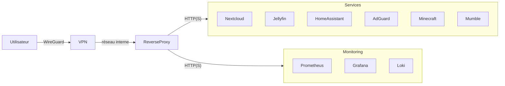
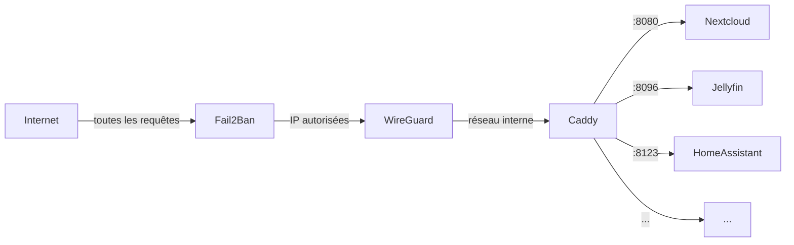

Un soir de 2022, ma box est tombée. Rien de dramatique en soi, juste une vingtaine de minutes d'interruption. Le problème, c'est ce que cette coupure a révélé : en un instant, je me suis retrouvé privé de ma musique, de mes documents et de mes prises de notes. Tout était chez Google, Spotify ou Dropbox. Je ne possédais plus rien en local, je ne contrôlais plus rien.

J'avais déjà tenté l'aventure du serveur perso avant le COVID, mais sans méthode : du distro hopping compulsif, des configs bancales et des nuits entières à passer au peigne fin des paquets orphelins. Résultat, je finissais toujours par tout abandonner.

Cette fois, j'ai abordé le problème autrement. Plutôt que de foncer tête baissée sur des outils, j'ai d'abord posé mes contraintes. Cet article retrace la construction de cette infrastructure, les choix d'architecture qui en ont découlé, et ce que cette aventure m'a réellement appris sur le terrain.

---

## Pourquoi ce projet ?

Cette panne d'internet a été l'étincelle, mais le problème venait de plus loin. Une vraie saturation vis-à-vis du cloud : les scandales de données, les CGU modifiées en douce, cette impression désagréable de dépendre de services qui peuvent fermer du jour au lendemain. J'avais simplement envie de réintroduire du local, du physique, du matériel qui m'appartient et fonctionne sans connexion.

C'était aussi l'occasion de franchir un cap technique. En entreprise, le réseau, les conteneurs, la sécurité ou le monitoring font partie du décor. Mais lire la doc ne suffira jamais : rien ne vaut la pratique sur une machine qui tourne H24 avec du vrai trafic dessus (domotique, stockage, serveurs de jeu). Mon homelab est devenu mon bac à sable ultime, en conditions réelles.

Et puis, soyons honnêtes : mon installation était un champ de ruines. Des années de bidouille avaient accumulé des configs bancales, des scripts fantômes et des paquets oubliés après un test d'un soir. Il fallait tout raser pour reconstruire proprement, documenter et enfin avoir un système maintenable.

---

## Architecture globale

L'infrastructure repose sur une machine unique. Tout accès distant passe d'abord par le VPN, puis par un reverse proxy, avant d'atteindre les services conteneurisés. Aucun port n'est ouvert directement sur Internet saut celui du VPN.
<br/>

<br/>
Ce schéma est volontairement simple. Il n'y a pas de haute disponibilité, pas de cluster, pas de réplication automatique. C'est un choix assumé, j'y reviens plus loin.

---

## Le matériel

Le serveur est un **Beelink MINI-S12 Pro**. Un mini-PC à processeur Intel N100, silencieux, compact, et remarquablement sobre en énergie.
<br/>
| Composant    | Détail                                    |
|--------------|-------------------------------------------|
| CPU          | Intel N100 (4 cœurs, faible consommation) |
| RAM          | 16 Go                                     |
| Stockage     | SSD 512 Go (système + données)            |
| Consommation | ~10–15 W en charge                        |
<br/>


Pas d'ECC, pas de RAID, pas de redondance. Ce n'est pas du matériel de datacenter, et c'est très bien ainsi. Pour une dizaine de conteneurs et quelques utilisateurs simultanés, le N100 ne bronche pas.

La seule limite qui commencera à se faire sentir, c'est le stockage, notamment pour Jellyfin, qui grossit avec la médiathèque. Une évolution matérielle est probable à terme, mais elle n'est pas urgente.

---

## Les choix techniques

### Debian

Le serveur tourne sous **Debian 13**. Stable, prévisible, supportée jusqu'en 2035.

Pendant des années, j'ai utilisé Fedora ou Arch sur mes machines personnelles, convaincu qu'être toujours à la dernière version était une bonne pratique de sécurité.

En réalité, les rolling releases m'ont surtout apporté des régressions inattendues : un noyau qui casse un driver réseau, une mise à jour qui change le comportement d'un service système.

Debian stable est ennuyeuse. C'est exactement ce qu'il faut.
<br/>
### Docker Compose

J'ai tranché pour **Docker** et **Compose**. Pas par méconnaissance du reste, mais pour l'écosystème : c'est ultra-documenté, éprouvé, et le ticket d'entrée est imbattable quand on veut avancer vite.

L'immense force de Compose, c'est la clarté. Chaque service a son propre dossier, son `docker-compose.yml`, ses secrets isolés dans un `.env`, et le tout est versionné dans un repo Git local. Si la machine explose demain ? Je réinjecte mon dépôt, un coup de `docker compose up -d` dans chaque dossier, et tout repart exactement comme avant.

Évidemment, Docker n'est pas parfait. Le daemon qui tourne historiquement en root, la surface d'attaque, la gestion des secrets un peu rustique sans Swarm... ce sont des vrais sujets. Je surveille Podman de près, qui corrige pas mal de ces défauts.

Sur un projet plus critique, la question se poserait sérieusement. Mais ici, j'ai privilégié l'efficacité et la simplicité brute.

Voici à quoi ressemble un service typique :
<br/>
```yaml
services:
  nextcloud:
    image: nextcloud:stable
    container_name: nextcloud
    volumes:
      - /srv/data/nextcloud:/var/www/html/data
    ports:
      - "8080:80"
    restart: unless-stopped
```
<br/>

La configuration est séparée des données persistantes. Les secrets ne sont jamais dans le fichier Compose, ils passent par `.env`. 

Le `restart: unless-stopped` assure que le service redémarre automatiquement après un reboot.

<br/>
### WireGuard + Caddy

L'accès distant passe par **WireGuard**, avec **wg-easy** pour gérer les pairs sans se battre avec des fichiers de configuration à la main. Aucun service n'est exposé directement. Tout transite par le VPN.

Côté reverse proxy, j'ai choisi **Caddy** après avoir longuement hésité avec Traefik. Traefik est excellent sur le papier, mais sa configuration correcte en Docker Compose, labels, middlewares, providers, s'est révélée pénible à déboguer.

Caddy, lui, génère automatiquement les certificats HTTPS via Let's Encrypt et se configure en quelques dizaines de lignes au total. Je n'y touche presque plus.

**Fail2Ban** complète le dispositif en bloquant les IP qui multiplient les tentatives d'authentification sur SSH et Caddy.


<br/>

<br/>
---

## Les services déployés

Une dizaine de conteneurs tournent en permanence. Voici les principaux :
<br/>
| Service            | Rôle                                               |
|--------------------|----------------------------------------------------|
| **Nextcloud**      | Stockage et synchronisation de fichiers            |
| **Jellyfin**       | Serveur multimédia personnel                       |
| **Home Assistant** | Domotique : capteurs Zigbee, automatisations ESP32 |
| **AdGuard Home**   | Filtrage DNS, blocage publicitaire sur le réseau   |
| **Minecraft**      | Serveur de jeu pour quelques amis                  |
| **Mumble**         | Serveur vocal léger, utilisé en local              |
<br/>
Chaque conteneur a ses volumes dédiés, configuration d'un côté, données persistantes de l'autre. Cette isolation garantit qu'un problème sur un service n'affecte pas les autres : redémarrer Jellyfin ne touche pas Nextcloud, mettre à jour Home Assistant ne risque pas de corrompre les données AdGuard.

Home Assistant mérite une mention particulière. Ce qui a commencé comme un test avec deux capteurs de CO2 s'est progressivement étendu : capteurs Zigbee, automatisations ESP32 faites maison.

C'est le service qui a le plus évolué, et celui dont l'arrêt se remarque le plus vite.

---

## Monitoring

Superviser l'infrastructure, c'est la partie qu'on néglige jusqu'au jour où quelque chose tombe sans qu'on sache depuis combien de temps. J'utilise trois outils en stack :

**Prometheus** collecte les métriques système et conteneurs. CPU, RAM, disque, réseau, état des services. Il scrape les exporters et stocke les séries temporelles localement.

**Grafana** consomme ces métriques et les affiche dans des dashboards personnalisés.

**Loki** agrège les logs de l'ensemble des conteneurs. C'est surtout utile pour le serveur Minecraft. Retrouver la cause d'un crash ou d'une lenteur en quelques secondes plutôt qu'en épluchant des fichiers `.log` à la main.

Ce trio n'est pas léger à mettre en place, mais une fois opérationnel, il change complètement la façon dont on interagit avec l'infrastructure. 

On passe d'une gestion réactive ("quelque chose est cassé, qu'est-ce que c'est ?") à une gestion proactive ("le disque est à 80 %, il faut nettoyer avant la semaine prochaine").

---

## Ce que j'ai écarté et pourquoi

Avec un seul serveur et une dizaine de conteneurs, la tentation de surcharger la stack est réelle. Voici ce que j'ai consciemment mis de côté :

**Kubernetes** : K3s, K8s, peu importe la déclinaison. L'orchestration de pods, la gestion du réseau overlay, les ConfigMaps, les Secrets Kubernetes... tout ça a du sens quand on gère des dizaines de services sur plusieurs nœuds. Pour un serveur unique, c'est ajouter dix couches de complexité pour résoudre des problèmes qu'on n'a pas. Un `docker compose up` suffit.

**Ansible, Puppet, Chef** : l'automatisation de configuration est séduisante sur le papier. En pratique, pour une seule machine, des scripts bash bien commentés et des services systemd font exactement le même travail sans la surcharge cognitive. J'expérimente Ansible en parallèle pour monter en compétence, mais je ne l'utilise pas en production ici.

**Traefik** : je l'ai mentionné plus haut. Excellent outil, mais Caddy résout le même problème avec moins de configuration.

Chaque outil supplémentaire est une chose à maintenir, à mettre à jour, à déboguer. Un home server qu'on oublie pendant trois semaines et qui tourne toujours est bien plus précieux qu'une stack impressionnante qui demande une attention constante.

---

## Ce que j'envisage pour la suite

Rien d'urgent, mais quelques pistes que je garde en tête :
<br/>
| Domaine                | Piste envisagée                                                                              |
|------------------------|----------------------------------------------------------------------------------------------|
| OS                     | Migrer vers **NixOS** pour déclarer tout le système de manière reproductible                 |
| Sauvegardes            | Mettre en place des sauvegardes externalisées avec **restic** ou **Borg** vers un stockage distant |
| CI/CD                  | Automatiser les déploiements via Forgejo Actions ou GitHub Actions                           |
| Résilience             | Ajouter une réplication des volumes critiques et un basculement manuel documenté             |
| Infrastructure as code | Expérimenter **Terraform** pour décrire les conteneurs, réseaux et volumes                   |
<br/>
NixOS est probablement la piste qui m'intéresse le plus. 

L'idée de décrire l'intégralité du système dans un fichier versionné et de pouvoir rejouer cette configuration sur n'importe quelle machine est exactement dans la continuité de ce que j'ai construit ici.

---

## Ce que trois ans m'ont appris

Les choix ennuyeux sont souvent les bons.

Debian plutôt qu'Arch. Docker plutôt que Kubernetes. Caddy plutôt que Traefik.

À chaque fois, j'ai choisi la solution qui demande le moins d'attention quotidienne et à chaque fois, c'était la bonne décision.

La documentation est le vrai produit.

Le code, les configs, les scripts : tout ça peut se reconstruire. Ce qui prend du temps, c'est de se souvenir *pourquoi* on a fait tel choix six mois plus tôt.

Aujourd'hui, chaque service a son propre `README.md` qui explique l'installation, les dépendances, et les pièges connus.

Et j'ai appris qu'un home server n'est jamais vraiment "terminé" mais qu'il peut atteindre un état où on n'a plus besoin de s'en préoccuper en permanence.

La prochaine panne internet peut venir. Ma musique jouera quand même.